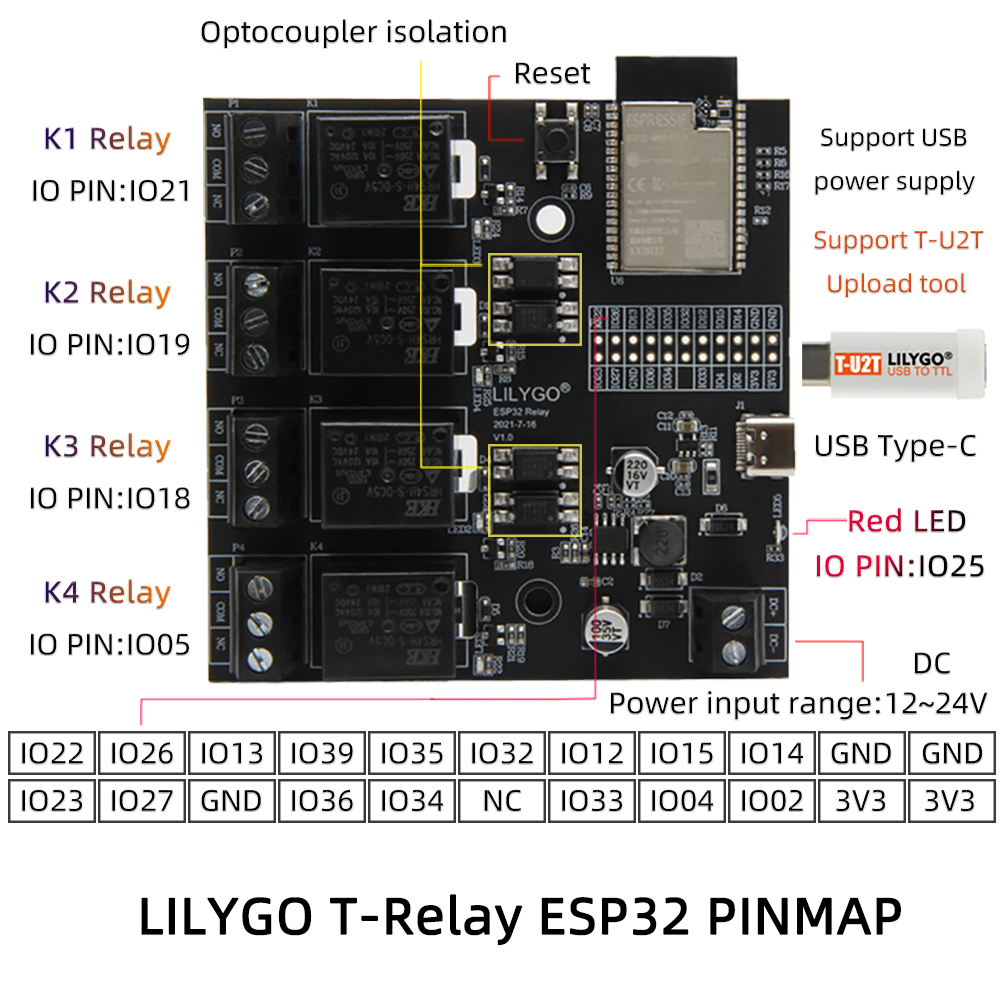

<h1 align = "center">🌟LILYGO T-RELAY🌟</h1>

## **English | [中文](./README_CN.MD)**

<h3 align = "left">Quick start:</h3>

1. Install the current upstream Arduino IDE at the 1.8 level or later. The current version is at the [Arduino website](http://www.arduino.cc/en/main/software).
2. Start Arduino and open Preferences window. In additional board manager add url: https://raw.githubusercontent.com/espressif/arduino-esp32/gh-pages/package_esp32_index.json .separating them with commas.
3. Select Tools -> Board -> ESP32 Dev Module
4. Need to install the following dependencies
     - [blynk-library](https://github.com/blynkkk/blynk-library)
     - [ESP-DASH](https://github.com/ayushsharma82/ESP-DASH)
     - [AsyncTCP](https://github.com/me-no-dev/AsyncTCP)
     - [ESPAsyncWebServer](https://github.com/me-no-dev/ESPAsyncWebServer)

<h3 align = "left">Product 📷:</h3>

| Product |       Product  Link       |
| :-----: | :-----------------------: |
| T-Relay | [AliExpress]() [Amazon]() |

## Pinout

