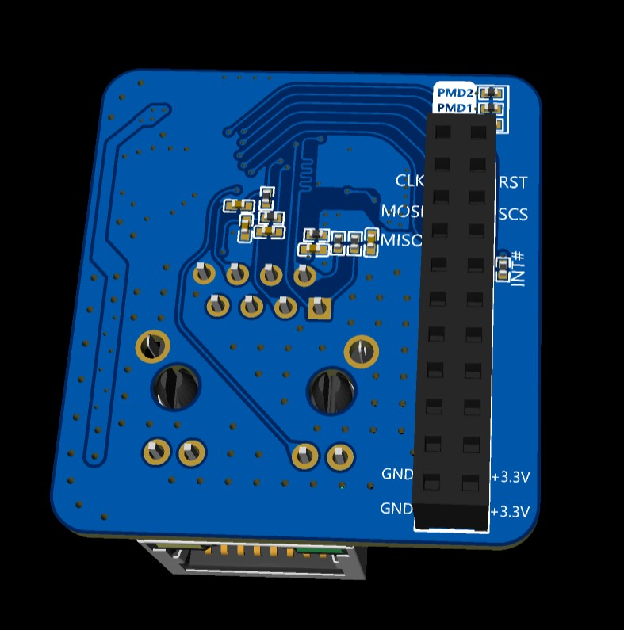

<h1 align = "center">🌟LILYGO T-Relay Series🌟</h1>

## 1️⃣ Quick Start:

* T-Relay 4 Channel (Basic ESP32) **[English](docs/RELAY_ESP32.md)/[中文](docs/RELAY_ESP32_CN.MD)**
* T-Relay 8 Channel (Basic ESP32) **[English](docs/RELAY_ESP32.md)/[中文](docs/RELAY_ESP32_CN.MD)**
* T-Relay S3 (Basic ESP32S3)      **[English](docs/RELAY_ESP32S3.MD)/[中文](docs/RELAY_ESP32S3_CN.MD)**

## 2️⃣ Where to buy:

#### T-Relay 4 Channel (Basic ESP32)
[LilyGo Shop](https://www.lilygo.cc/products/t-relay)

#### T-Relay 8 Channel (Basic ESP32)
[LilyGo Shop](https://www.lilygo.cc/products/t-relay-5v-8-channel-relay)

#### T-Relay S3 (Basic ESP32S3)
[LilyGo Shop](https://www.aliexpress.us/item/3256805375487806.html?spm=5261.ProductManageOnline.0.0.35ce2ddb2C2zD8&gatewayAdapt=glo2usa4itemAdapt)

## FAQ

* Q. How should I correctly connect the W5500 Shield to the motherboard?
* A. There are two versions of the W5500 Shield.

    1.T-Relay 4 Channel and T-Relay 8 Channel versions
    

        
        
    

    

        
    

    2.T-Relay S3 versions
    

        
        
    

    

        
    

 