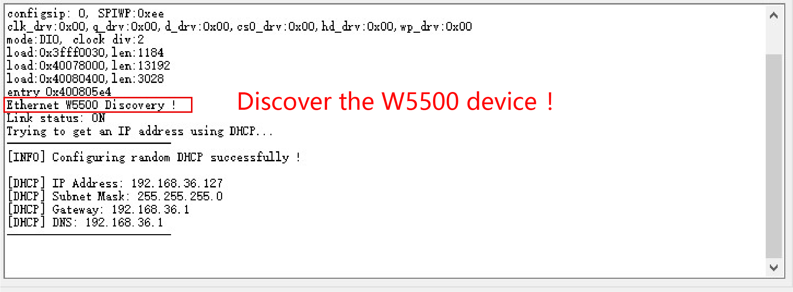
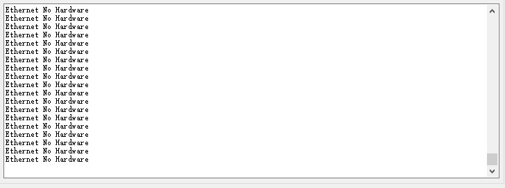
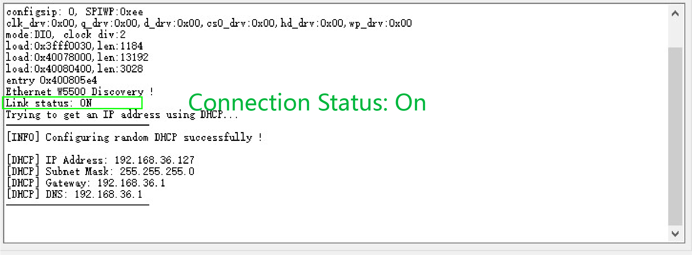
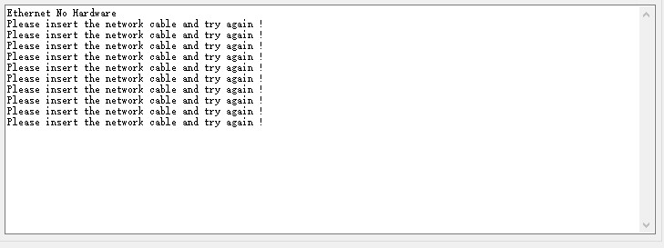
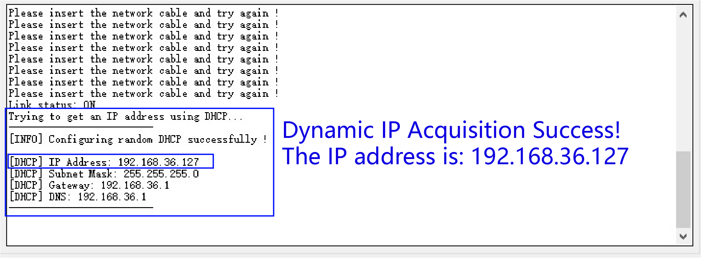
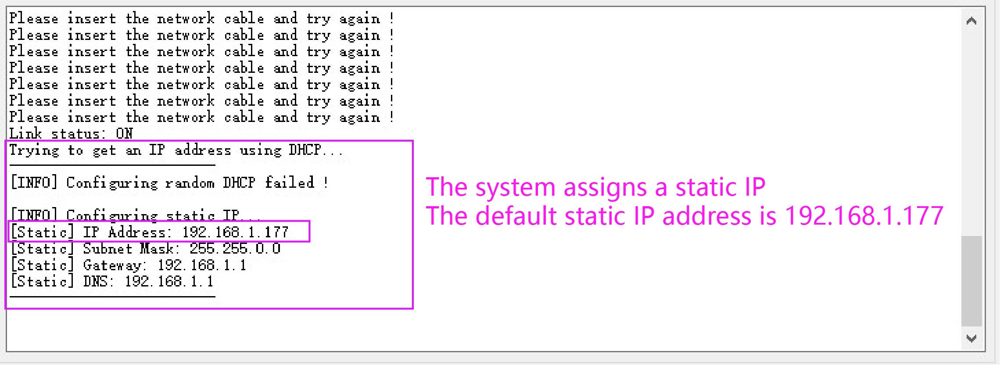
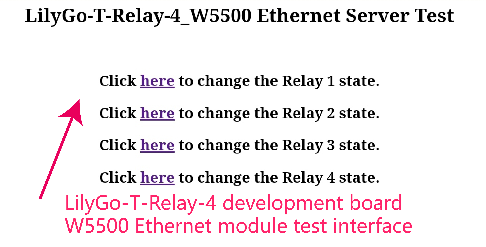
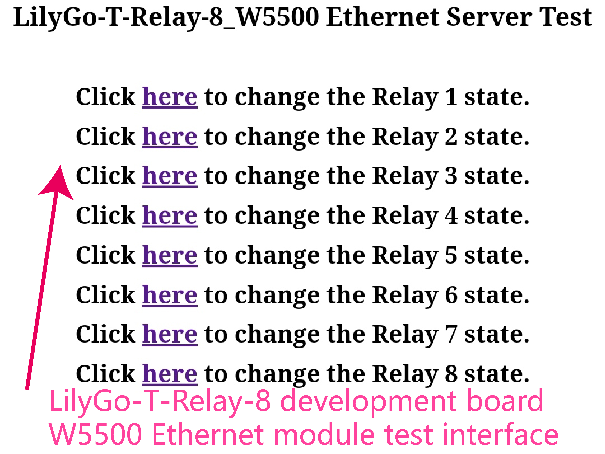

<!--
 * @Description: None
 * @version: V1.0.0
 * @Author: None
 * @Date: 2023-07-21 15:51:36
 * @LastEditors: LILYGO_L
 * @LastEditTime: 2023-07-21 17:29:46
 * @License: GPL 3.0
-->
## Test Instructions V1.0
---
### 1.Whether the W5500 device can be found
* 1.1 Insert the W5500 into the LILYGO-T-Relay, with the Ethernet port facing the edge of the board. After opening the serial port, if there is a W5500 device, it will display "Ethernet W5500 Discovery!" 

* 1.2 Otherwise, it will display "Ethernet No Hardware". 

### 2.Whether the Ethernet jack and W5500 chip can communicate properly
* 2.1 After the W5500 device is correctly recognized, insert the router-connected Ethernet cable, and you will see "Link status: ON" on the serial port, indicating that the connection is normal. (There are 3 states: "Link status: ON" indicates a normal connection, "Link status: OFF" indicates that the Ethernet port is not plugged in, and "Link status: Unknown" indicates an unknown connection, which is a hardware error and the W5500 and Ethernet port cannot communicate.) 

* 2.2 After the W5500 device is correctly recognized, but without inserting the Ethernet cable, it will display "The network cable is not connected!", "Please insert the network cable and try again!", indicating that the Ethernet cable is not inserted, please insert the Ethernet cable and try again. 

### 3.Whether it can obtain a dynamic IP address (DHCP) properly
* 3.1 If the W5500 can be correctly recognized and the Ethernet cable is connected properly, the system will automatically obtain a random IP address from the router. After waiting for a few seconds, the obtained network IP information will be output to the serial port. 

* 3.2 If there are any unexpected situations during the connection (such as plugging in a non-router device into the Ethernet port, or disconnecting during the connection), a static IP address will be assigned. 

### 4.Whether the relays can be controlled through the web interface
* 4.1 Open the browser on your mobile phone or computer and enter the dynamic IP address (DHCP) assigned by the router, which is displayed on the serial port in 3.1. You will see the LilyGo-T-Relay-4W5500 Ethernet Server Test interface, which has 4 relay control options. If you are using the LilyGo-T-Relay-8 development board, the LilyGo-T-Relay-8W5500 Ethernet Server Test interface will be displayed, which has 8 relay control options. 

* 4.2 Click on "here" on the web page to control the opening and closing of the relays.