<h1 align = "center">🌟LILYGO T-RELAY🌟</h1>

## Quick start
1. Register and login [blynk.cloud](https://blynk.cloud/dashboard/login)
2. Create a new template or use an existing template (The name can be customized)

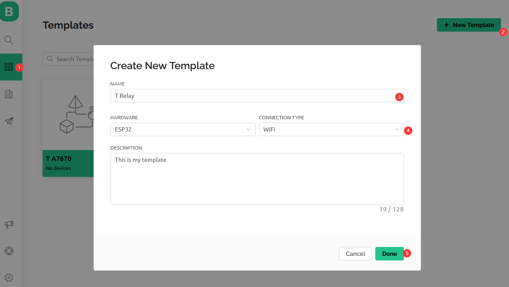

3. When the Template is ready, go to Search -> Devices - Create New Device

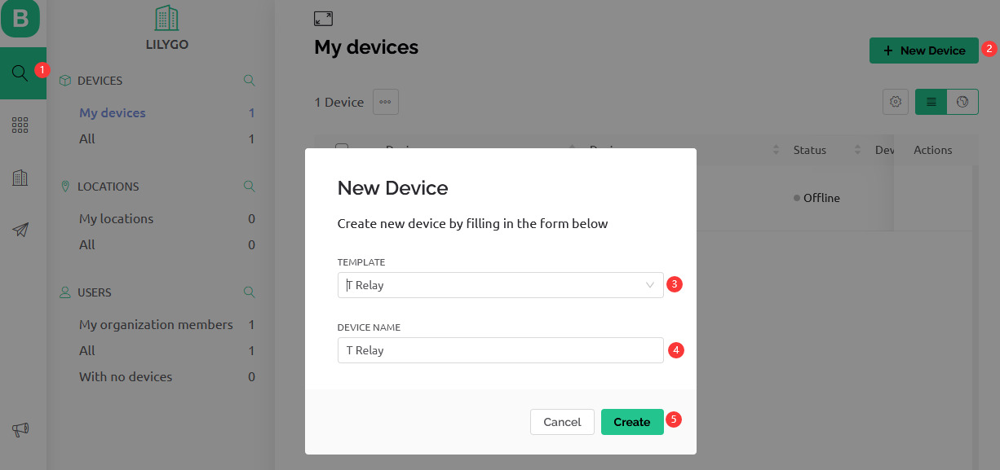

4. Configuration module

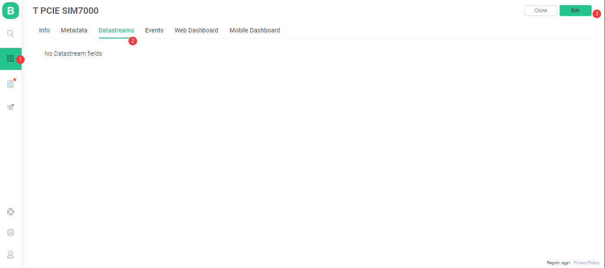
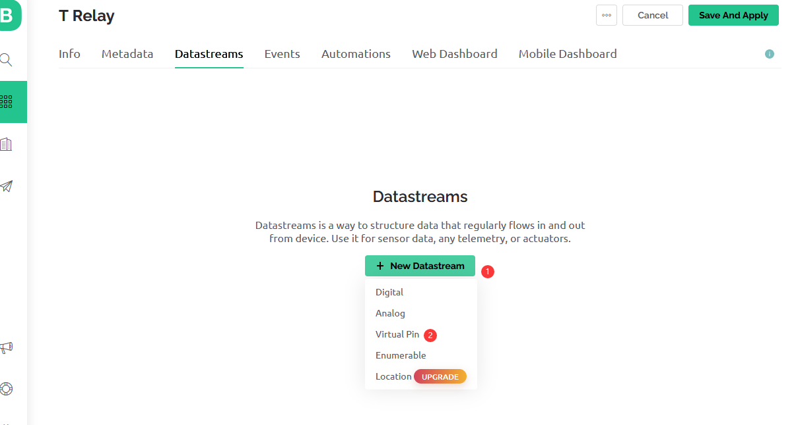
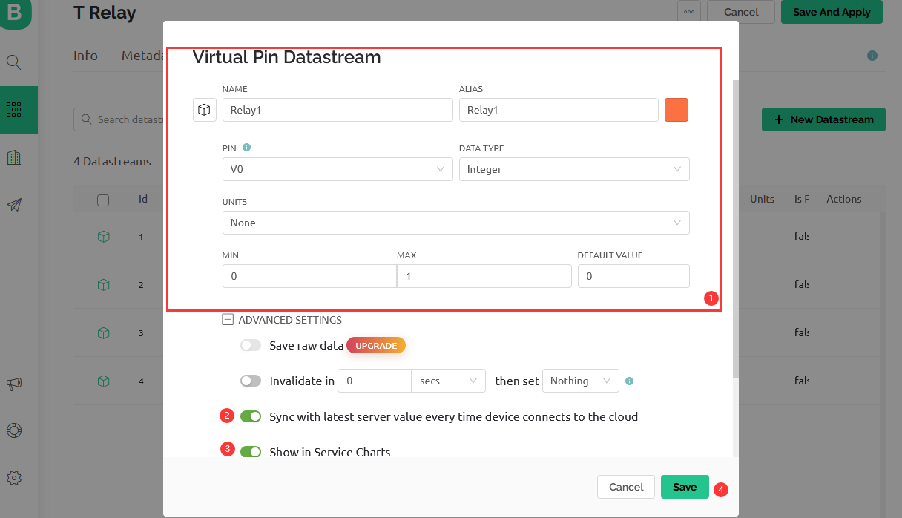
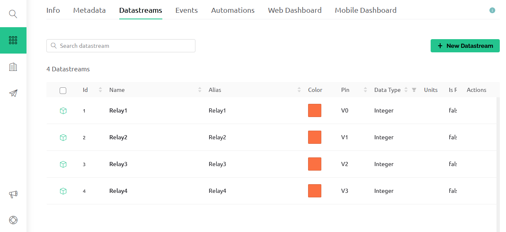

5. Set up the Web dashboard 

    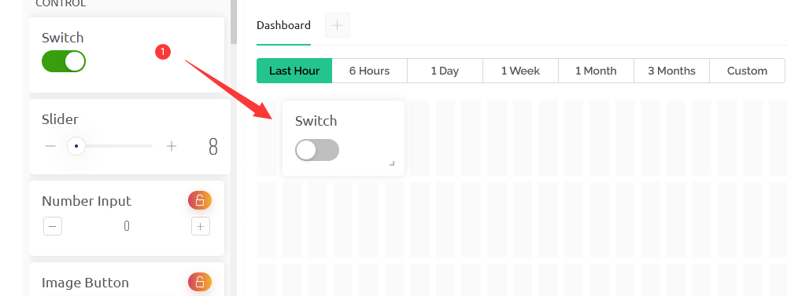
    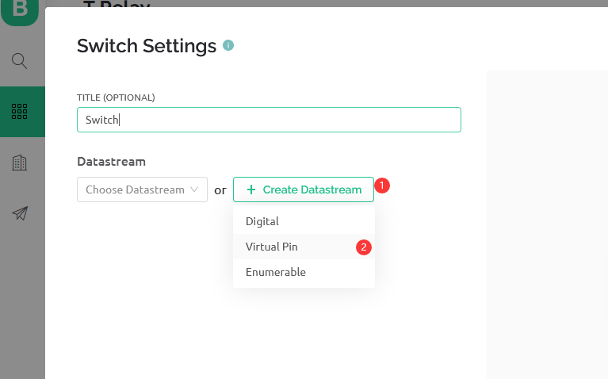
    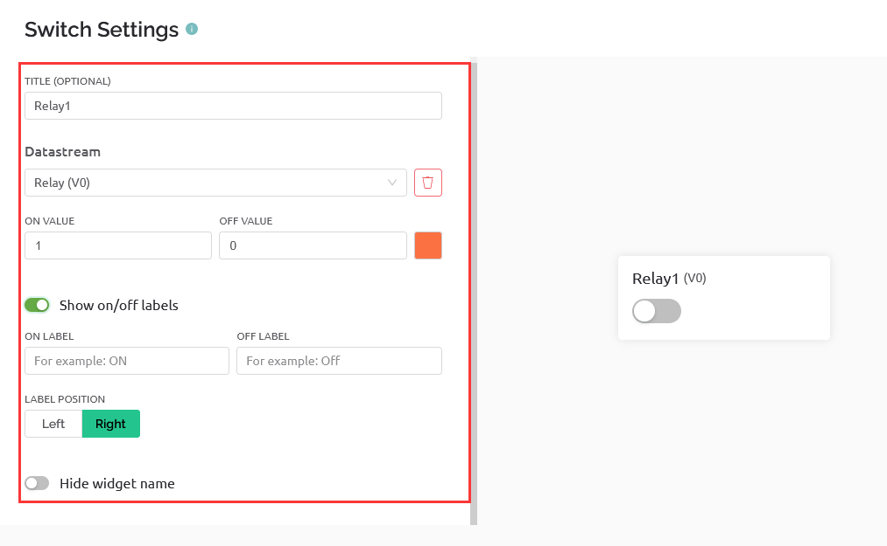

6. Create a New Event. Go to Template -> Edit -> Events tab.

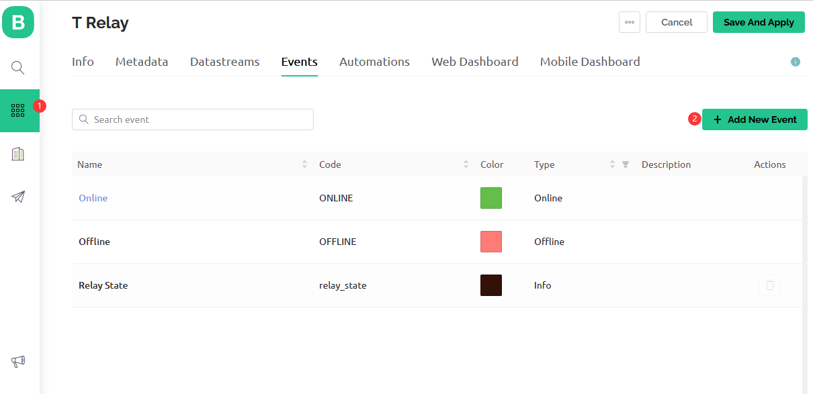

7. Replace the macro definition in the code

    #define BLYNK_TEMPLATE_ID "" 
    #define BLYNK_DEVICE_NAME "" 
    #define BLYNK_AUTH_TOKEN ""

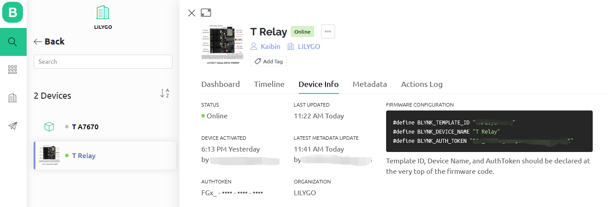

8. Upload the code and now you control the LDE and get the data in the cloud

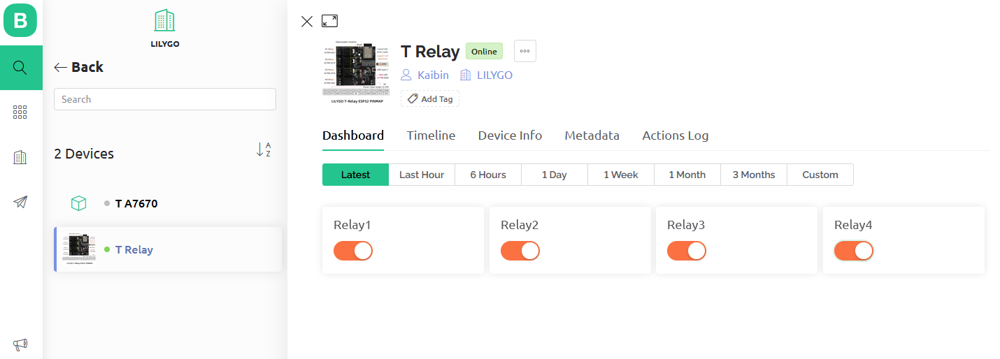

9. USE [blynk.app](https://docs.blynk.io/en/downloads/blynk-apps-for-ios-and-android)

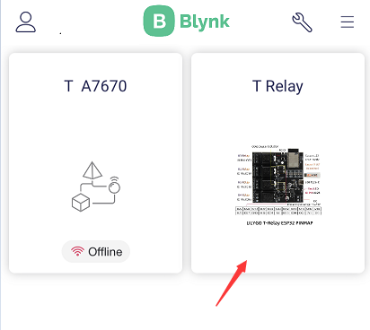
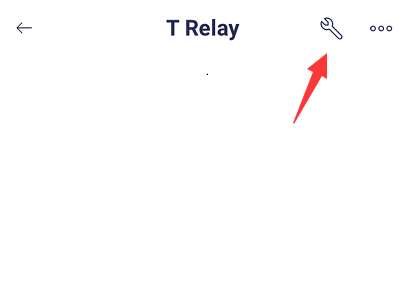
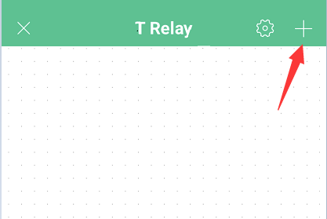
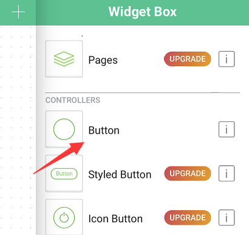
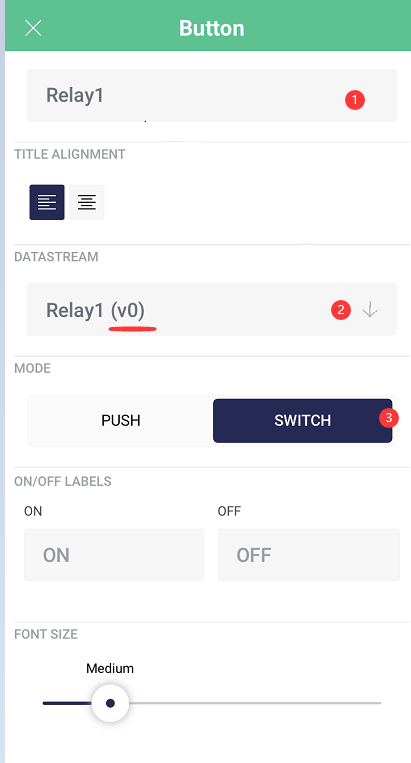
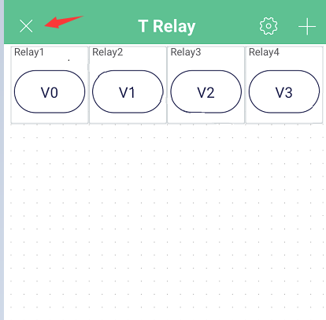
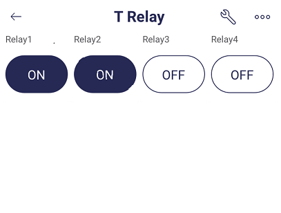

## Blynk References

1. [Getting Started Guide](https://www.blynk.cc/getting-started)
2. [Documentation](https://docs.blynk.io/en/blynk.apps/overview)
3. [Sketch generator](https://examples.blynk.cc/)
